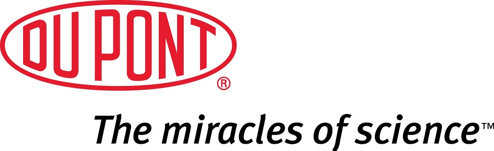
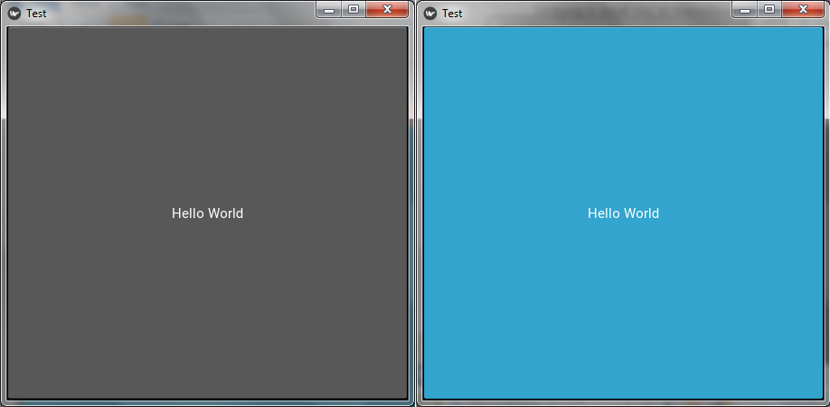
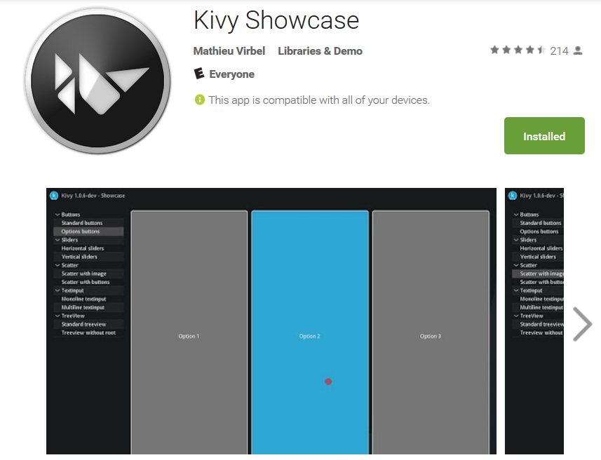
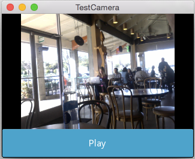

# Kivy 

David Ernstrom

Python Utah North, February 2015

<a href="">http://ernstrom.net/kivy.html</a>

.fx: titleslide

# presenter notes

Kivy - Open source Python library for rapid development of applications
that make use of innovative user interfaces, such as multi-touch apps.

---

# About me

Python developer since 2006

Grew up in the Davis County area

Moved to Logan in 2001 after religious sabbatical to British Columbia

Graduated from USU with BCompSc, BEng, MBA

Python Software engineer & DBA for DuPont Authentication since 2006

---

# presenter notes

World leader in Photopolymer Holography, specifically the Anti-Counterfeiting Industry

Customers apply our holographic labels to products susceptible to being counterfeit.

We protect customers such as Brother, 3Com, Epson, Cisco, among others.

Are the only ones in the world who can mass produce a hologram that has 2 dimensions of paralax.

"count the dots" scheme, look at all 4 sides of a hologram

My software is integral in design, creation, mass-production, tracking, and management of holographic production

Codebase of in-house developed python code is 41,000 LOC with a pylint grade of 6.13.

Shipped worldwide.  Python systems used an ODBC connection to pull shipment data for producing address labels.  Started shipping product occasionally to Bogotá Columbia

---

# Cross Platform

.fx:

# presenter notes

Kivy runs on Linux, Windows, OS X, Android and iOS.
You can run the same code on all supported platforms.
This is why I found Kivy - I wanted to write Python and send to
multiple devices.

---

# Native Inputs
* most inputs, protocols and devices
    * WM_Touch
    * WM_Pen
    * Mac OS X Trackpad
    * Magic Mouse
    * Mtdev
    * Linux Kernel HID
    * TUIO
* A multi-touch mouse simulator is included.

.fx: smallest

# presenter notes

Kivy supports native inputs.  They just pretty much work.

---

# Business Friendly

* 100% free to use
    * MIT license (starting from 1.7.2)
    * LGPL 3 (prior to 1.7.2).
* The toolkit is professionally developed, backed and used.
* You can use it in a commercial product.
* Framework is stable and has a well documented API.
* Programming guide to help you get started.

.fx: smallest

# presenter notes

---

# GPU Accelerated

* Graphics engine is built over OpenGL ES 2, using a modern and fast graphics pipeline.
* More than 20 widgets, all highly extensible.
* Many parts are written in C using Cython, and tested with regression tests.

.fx: smaller

# presenter notes

GPU Accelerated

---

# Example

    !python
    from kivy.app import App
    from kivy.uix.button import Button

    class TestApp(App):
        def build(self):
            return Button(text='Hello World')

    TestApp().run()

.fx: smaller

# presenter notes

---

# Example Output

# presenter notes

Very simple.  One huge button.

---

# presenter notes

App to demo capability and sample widgets in Play Store (Android).

---

# PyCon / Flappy Bird

[https://youtu.be/U14P8gtjQmU](https://youtu.be/U14P8gtjQmU)

Click here for demo

# presenter notes

Then I started exploring example applications and remembered hearing about
a Kivy tutorial at PyCon in 2015.

Show flappy bird on phone? on computer?

---

# App Architecture (*.kv)

* Great Loose Coupling Design
* Screen Layout in *.kv files
* Leaves Python code to do logic

[https://kivy.org/docs/](https://kivy.org/docs/)

# presenter notes

So I started studying more and learning about *.kv files
here's an example of how the previous example collapses once the
UI is removed from the Python code.

---

# *.kv files

    !python
    """
    Kivy implicitly searches for a .kv file.
    test.kv is selected because name of subclass.
    That file contains a root Widget.
    """
    import kivy
    kivy.require('1.0.7')
    from kivy.app import App

    class TestApp(App):
        pass
    if __name__ == '__main__':
        TestApp().run()

test.kv

    !python
    #:kivy 1.0

    Button:
        text: 'Hello from test.kv'

.fx: smallest

# presenter notes

---

Camera Example

    !python
    from kivy.app import App
    class TestCamera(App):
        pass
    TestCamera().run()

What is our *.kv file named?

    !python
    BoxLayout:
        orientation: 'vertical'
        Camera:
            id: camera
            resolution: (640, 480)
            play: False
        ToggleButton:
            text: 'Play'
            on_press: camera.play = not camera.play
            size_hint_y: None
            height: '48dp'

.fx: smallest

# presenter notes

If the camera doesn't exist, kivy will crash

---

# Packaging for Android

Two Options

* Kivy Launcher
* Compile directly
    * python-for-android / Kivy IOS
    * Buildozer - Automates the entire build process
        * downloads/sets up prequisites for python-for-android
        * downloads/sets up android SDK and NDK
        * builds an apk that can be automatically pushed to the device

Buildozer doesn't run on Windows

Enter: VirtualBox and KivyVM

.fx: smallest

# presenter notes

---

# VirtualBox / KivyVM

.fx:

# presenter notes

---

# Mobile Dev Gotchas

(Android)

* Install google usb drivers on windows
* Tell device to accept unofficial apps.
* Unlock app for development
    * Click "build number" 7 times
* Enable "adb"
    * "adb devices" lists devices running

.fx: smaller

# presenter notes
I was running through the virtual box and couldn't connect to my phone.
adb was a big deal.
google usb drivers on windows
So was the share usb devices, stuff in VirtualBox.

---

# Thank you

<a href="http://ernstrom.net/kivy.html">http://ernstrom.net/kivy.html</a>

.fx: titleslide
