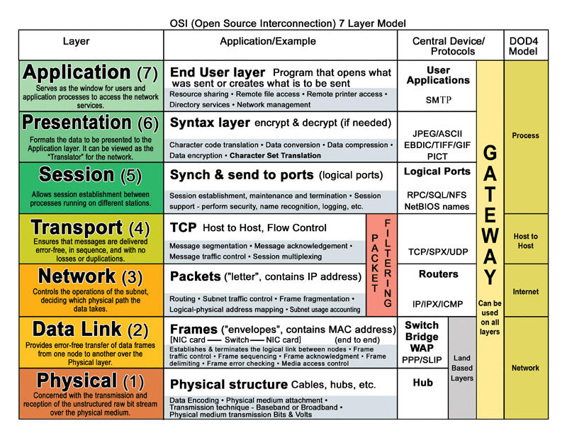

# Sockets & Requests

David Ernstrom

Python Utah North, April 2015

<a href="">http://ernstrom.net/socket_requests.html</a>

.fx: titleslide

# presenter notes

Sockets & Requests

---

# About me

Python developer since 2006

Grew up in the Davis County area

Moved to Logan in 2001 after religious sabbatical to British Columbia

Graduated from USU with BCompSc, BEng, MBA

Python Software engineer & DBA for DuPont Authentication since 2006

---

# presenter notes

World leader in Photopolymer Holography, specifically the Anti-Counterfeiting Industry

Customers apply our holographic labels to products susceptible to being counterfeit.

We protect customers such as Brother, 3Com, Epson, Cisco, among others.

Are the only ones in the world who can mass produce a hologram that has 2 dimensions of paralax.

"count the dots" scheme, look at all 4 sides of a hologram

My software is integral in design, creation, mass-production, tracking, and management of holographic production

Codebase of in-house developed python code is 44,401 LOC with a pylint grade of 7.28.

---

# What are sockets?

.fx:

# presenter notes
Where do they fall on the OSI model.
Fall in Session as an interface to Transport

---

# Code Examples

    !python
    import socket

    connection = socket.socket(socket.AF_INET, socket.SOCK_STREAM)
    connection.settimeout(timeout_val)

    connection.connect((host, port))

    # Do meaningful stuff, e.g., send & receive

    connection.shutdown(socket.SHUT_RDWR)
    connection.close()

.fx:

# presenter notes

Walk through code example
talk about STREAM vs DGRAM and discuss TCP vs UDP and when you'd use each
benefit of timeout?
Discuss shutdown vs shutdown & close

---

# Send & Receive

(meaningful stuff)

    !python
    def recv(self, length=1024, select_timeout=3.0):
        readable, _, _ = select.select([self.handle], [], [],
            select_timeout)
        if not readable:
            logging.warning("Select was not readable")
            raise socket.timeout()
        return self.handle.recv(length).decode('utf-8')

    def sendall(self, data):
        self.handle.sendall(data.encode('utf-8'))

.fx: smaller

# presenter notes
discuss unicode decode and encode vs utf-8.
obviously don't have to encode if already in binary bytes

---

# Binary Data

    !python
    s1 = struct.Struct(b'>I')
    def get_image(image_socket):
        image_socket.connection.settimeout(10.01)
        try:
            my_buffer = image_socket.read(4)
        except socket.timeout:
            return None
        image_socket.connection.settimeout(30)
        if len(my_buffer) != 4:
            # should prevent error: unpack_from requires buffer of at least 4 bytes
            return None
        packet_len = s1.unpack_from(my_buffer)[0]
        try:
            image_data = image_socket.read_all(packet_len)[0]# [1]==bytes_read
        except socket.timeout:
            msg = "Timeout while reading image."
            raise SocketError(msg)
        try:
            pil_image = Image.open(StringIO(image_data)).convert('RGB')
        except AttributeError:
            # is raised when image does not open properly so won't convert to RGB
            return None
        return pil_image

* Delimiters & Messaging system
* can send binary data (suggest first byte is size), or use terminator

.fx: smallest

# presenter notes
discuss struct as decoding binary data from big endian to integer to get packet_len
note that we have a helper method called read_all that enforces reading the whole file
and combining it

---

# Requests

    !python
    >>> import requests
    >>> r = requests.get('https://api.github.com/user',
                         auth=('user', 'pass'))
    >>> r.status_code
    200
    >>> r.headers['content-type']
    'application/json; charset=utf8'
    >>> r.encoding
    'utf-8'
    >>> r.text
    u'{"type":"User"...'
    >>> r.json()
    {u'private_gists': 419, u'total_private_repos': 77,
       ...}

# presenter notes

Seriously, that's it.

---

# Websockets (if time)

* What is a websocket
* how does it compare to an HTTP/HTTPS request?
* how can it be used?

.fx: smaller

# presenter notes

---

# Websockets (server)

pip install TwistedWebsocket

# Websockets (client)

pip install websocket-client

.fx:

# presenter notes

---
WS Server Example

    !python
    from twisted.internet.protocol import Factory
    from twisted.internet import reactor
    from TwistedWebsocket.server import Protocol
    import re

    class WebSocketHandler(Protocol):
        def on_handshake(self, header):
            g = re.search('Origin\s*:\s*(\S+)', header)
            if not g: return
            print "\n[HANDSHAKE] %s origin : %s" % (self.id, g.group(1))

        def on_connect(self):
            print "\n[CONNECTION] %s connected" % self.id
            for _id, user in self.users.items():
                user.sendMessage("%s connected" % self.id)
                print "\n[FRAME] from %s to %s:\n%s connected" % (self.id, _id, self.id)

        def on_disconnect(self):
            print "\n[DISCONNECTION] %s disconnected" % self.id
            for _id, user in self.users.items():
                user.sendMessage("%s disconnected" % self.id)
                print "\n[FRAME] from %s to %s:\n%s disconnected" % (self.id, _id, self.id)

        def on_message(self, msg):
            for _id, user in  self.users.items():
                user.sendMessage(msg)
                print "\n[FRAME] from %s to %s:\n%s" % (self.id, _id, msg)

    class WebSocketFactory(Factory):
        def __init__(self):
            self.users = {}

        def buildProtocol(self, addr):
            return WebSocketHandler(self.users)

    reactor.listenTCP(9999, WebSocketFactory()).run()

.fx: smallest

# presenter notes

---

WS Client Example

    !python
    import websocket
    import thread
    import time

    def on_message(ws, message):
        print message

    def on_error(ws, error):
        print error

    def on_close(ws):
        print "### closed ###"

    def on_open(ws):
        def run(*args):
            for i in range(3):
            time.sleep(1)
            ws.send("Hello %d" % i)
            time.sleep(1)
            ws.close()
            print "thread terminating..."
        thread.start_new_thread(run, ())

    if __name__ == "__main__":
        websocket.enableTrace(True)
        ws = websocket.WebSocketApp("ws://echo.websocket.org/",
            on_message = on_message,
            on_error = on_error,
            on_close = on_close)
        ws.on_open = on_open
        ws.run_forever()

.fx: smallest

# presenter notes

Take through app

---

# Questions?

# Thank you

<a href="http://ernstrom.net/socket_requests.html">http://ernstrom.net/socket_requests.html</a>

.fx: titleslide
