# 💩 υηι¢σ∂є 💩 

David Ernstrom

SLC Python, December 2015

<a href="">http://ernstrom.net/unicode.html</a>

.fx: titleslide


# presenter notes

I promised Faris that I'd include a steaming Pile of poo

We got that over with right away

---

# About me

Python developer since 2006

Grew up in the Davis County area

Moved to Logan in 2001 after religious sabbatical to British Columbia

Graduated from USU with BCompSc, BEng, MBA

Python Software engineer & DBA for DuPont Authentication since 2006

---


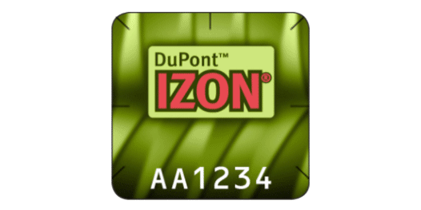

# presenter notes

World leader in Photopolymer Holography, specifically the Anti-Counterfeiting Industry

Customers apply our holographic labels to products susceptible to being counterfeit.

We protect customers such as Brother, 3Com, Epson, Cisco, among others.

Are the only ones in the world who can mass produce a hologram that has 2 dimensions of paralax.

"count the dots" scheme, look at all 4 sides of a hologram

My software is integral in design, creation, mass-production, tracking, and management of holographic production

Codebase of in-house developed python code is 41,000 LOC with a pylint grade of 6.13.

Shipped worldwide.  Python systems used an ODBC connection to pull shipment data for producing address labels.  Started shipping product occasionally to Bogotá Columbia

---

# Bogotá Columbia


.fx: imageslide whiteheading

# presenter notes

Systems would crash every time we shipped to Bogotá.

David was sad.

DuPont was sad.

Mitigation was to rewrite Bogota with an ethnocentric a.

I hate being ethnocentric and this was eye-opening to how ethnocentric I was being.

So began my quest into understanding Unicode.

---

# Unicode Whack-A-Mole


.fx: imageslide whiteheading

# presenter notes

You know that game.  UnicodeDecodeError.  UnicodeEncodeError

start stuffing .encode and .decode in random places to make the errors go away.

I wasn't proud of my code.

I was still sad.

However, my eyes were opened to how frequently it was occurring in our industry.

---

# Unicode Relevance

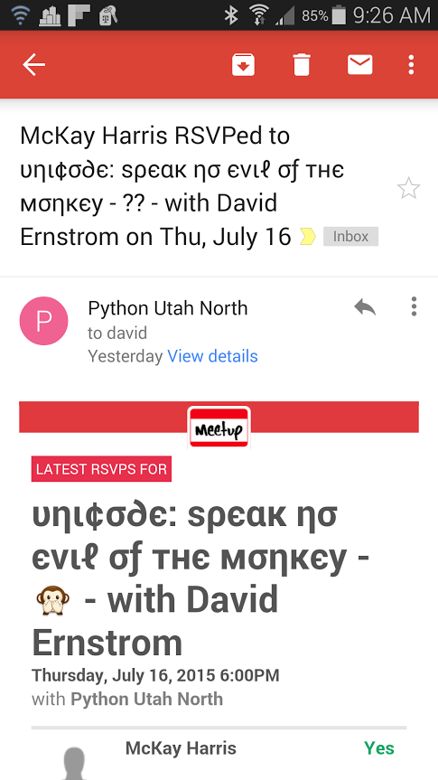

.fx: black_bkgd whiteheading

# presenter notes

We should be embarassed.  We should be truly embarassed.

We have a world economy.  We tout acceptance, respect, etc.

Even the Python Code of Conduct touts that we are "Open, Considerate, and Respectful."

But look at what our ethnocentric developers have done.

Let's look at a brief history of text in computer languages...

---

# Brief History

* Good ol' unaccented English letters
* Code for each character 32 - 127 called ASCII.
   Chars below 32 were unprintable.
* Everything great if you spoke English
* Bytes held 8 bits, OEM free-for-all started filling up the remaining 128-255.
   Thus invented "code pages"

.fx: smaller

# presenter notes

Back in the semi-olden days… everything was very simple.

The only characters that mattered to developers were good old unaccented English letters, and we had a code for them called ASCII which represented every character using a number 32-127.  Codes below 32 were called unprintable.

All was good, assuming you were an English speaker.

bytes == eight bits, "gosh, we can use 128-255 for our own purposes." Enter OEM free-for-all.

Eventually, got codified in the ANSI standard. In the ANSI standard, everybody agreed on what to do below 128, which was pretty much the same as ASCII, but there were lots of different ways to handle the characters from 128 and on up, depending on where you lived. These different systems were called code pages.

---

# Definition

* Unicode creates a single character set that includes every writing system (including Klingon).
* In Unicode, the letter A is a platonic ideal. It's just floating in heaven.
   This platonic A is different than B, and different from a, but the same as variations in font, spacing, etc.

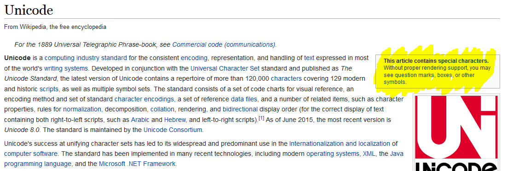

.fx: smaller

# presenter notes

Unicode was a brave effort to create a single character set that included every reasonable writing system on the planet and some make-believe ones like Klingon, too.

In Unicode, the letter A is a platonic ideal. It's just floating in heaven: A

This platonic A is different than B, and different from a, but the same as A and A and A.

Unicode is a computing industry standard for the consistent encoding, representation, and handling of text expressed in most of the world's writing systems.

Pay attention to that note at the side...

This article contains special characters, without proper rendering you may see question marks, boxes, or other symbols.

---

# Enter Unicode

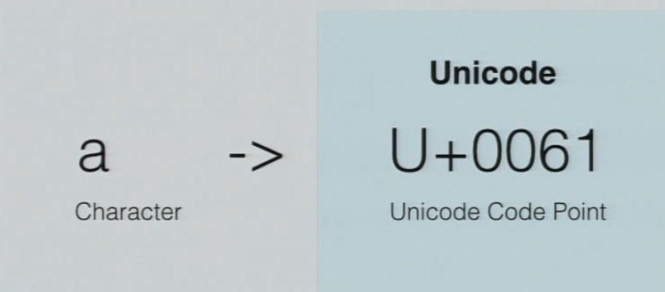

# presenter notes

Explain code point and platonic ideal.

Not represented on hard drive or across the wire.  Memory only.

---

# Birth of UTF-8

* UTF-8 stored string of Unicode code points (magic U+ numbers) in memory using 8 bit bytes.
* Every code point from 0-127 is stored in a single byte.
* Code points 128 and above are stored using 2, 3, and up to 6 bytes.
* English text looks the same in ascii as in UTF-8.

# presenter notes

How do we represent Unicode on the hard drive...

Fantastic convenience has shot us in the foot:

English text looks the same in ascii as in UTF-8.

---

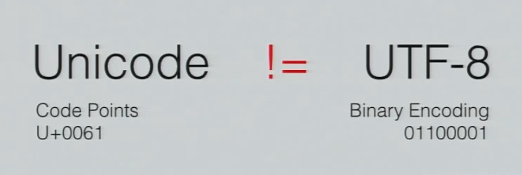

Google reported that in 2008 UTF-8 became the most common encoding for HTML files.

---

# Encodings Fact #1

>There Ain't No Such Thing As Plain Text.

<div class="cite">&mdash; <cite>Joel Spolsky</cite></div>

---

# Python 2 vs 3

#### Python 2: bytes are default; Implicit Conversion

    !python
    str('SLC Python')     # bytes
    unicode('SLC Python') # unicode
    b'SLC Python'         # bytes
    u'SLC Python'         # unicode

#### Python 3: unicode is default; Explicit Conversion

    !python
    bytes('SLC Python')   # bytes
    str('SLC Python')     # unicode

# presenter notes

We'll talk more about conversions later

But in short, we are forced to grow up in Python 3.

---

# Encodings Cheat Sheet

**Email**

```
Content-Type: text/plain; charset="UTF-8"
```

**Web**

    !html
    <meta http-equiv="Content-Type" content="text/html; charset=utf-8">

**Python**

    !python
    # -*- coding: utf-8 -*-
    from __future__ import unicode_literals

**MySQL**

```
utf8_general_ci
utf8_unicode_ci
```

* Difference? utf8_general_ci is satisfactory for both German and French, except that “ß” is equal to “s”, and not to “ss”. If this is acceptable for your application, you should use utf8_general_ci because it is faster. Otherwise, use utf8_unicode_ci because it is more accurate.

.fx: smallest

# presenter notes

python has additional header for unicode literals to facilitate migration to 3

mysql explanation of unicode

utf8_general_ci is satisfactory for both German and French, except that “ß” is equal to “s”, and not to “ss”.

If this is OK, you should use utf8_general_ci because it is faster.

Otherwise, use utf8_unicode_ci because it is more accurate.

---

# str vs unicode

str: a sequence of bytes

unicode: a sequence of code points

    !python
    >>> my_string = "Hello World"
    >>> type(my_string)
    <type 'str'>

    >>> my_unicode = u"Hi \u2119\u01b4\u2602\u210c\xf8\u1f24"
    >>> type(my_unicode)
    <type 'unicode'>

---

# How do I define a single string?

    !python
    u'The quick brown fox jumped over the lazy dog.'
    b'The quick brown fox jumped over the lazy dog.'
    'The quick brown fox jumped over the lazy dog.'

#### KNOW YOUR STRING ENCODINGS!

I should be able to ask about every string in your code and you know if it is Unicode or bytes.

---

# Error Handling

    !python
    >>> my_unicode.encode("ascii", "replace")
    'Hi ??????'
    >>> my_unicode.encode("ascii", "xmlcharrefreplace")
    'Hi &#8473;&#436;&#9730;&#8460;&#248;&#7972;'
    >>> my_unicode.encode("ascii", "ignore")
    'Hi '

---

# Mojibake

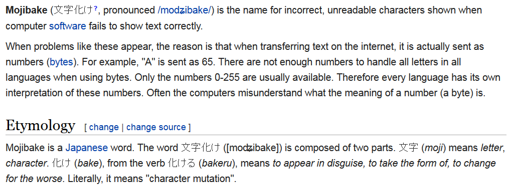

<div class="cite">&mdash; <cite>Wikipedia</cite></div>

---

# Mojibake Example


#### WinSCP

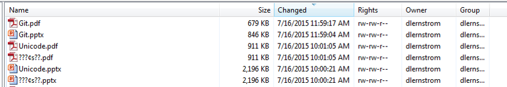

#### Taskbar of current presentation

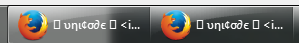

---

# Encode vs Decode

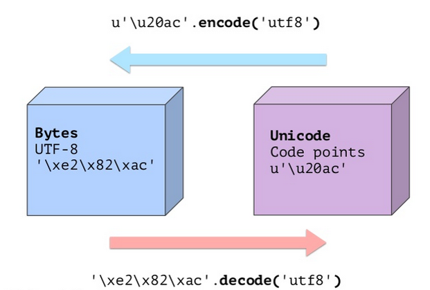

---

# Implicit Conversion

Python 2 has implicit conversion, Python 3 does not

    !python
    >>> u"Hello " + "world"
    u'Hello world'
    # This is the same as line 2 above
    >>> u"Hello " + ("world".decode("ascii"))
    u'Hello world'
    >>> sys.getdefaultencoding()
    'ascii'

# presenter notes

Straight from Ned Batchelder's talk:

There are lots of ways to combine two strings, and all of them will
decode bytes to unicode, so you have to watch out for them.

"world" is decoded from a ASCII-encoded bytes into Unicode for the concatenation

---

# Implicit Decoding Errors

    !python
    >>> u"Hello " + my_utf8
    Traceback (most recent call last):
    UnicodeDecodeError: 'ascii' codec can't decode byte
          0xe2 in position 3: ordinal not in range(128)

    # This is the exact same as line 1 above
    >>> u"Hello " + (my_utf8.decode("ascii"))
    Traceback (most recent call last):
    UnicodeDecodeError: 'ascii' codec can't decode byte
          0xe2 in position 3: ordinal not in range(128)

.fx: smaller

# presenter notes

In this example, my_utf8 is decoded as ascii-encoded bytes into Unicode for the concatenation.

It should have been decoded as 'utf8' into unicode explicitly

---

# Other implicit conversions

    !python
    >>> "Title: %s" % my_unicode
    u'Title: Hi \u2119\u01b4\u2602\u210c\xf8\u1f24'

    >>> u"Title: %s" % my_string
    u'Title: Hello World'

    >>> print my_unicode
    Traceback (most recent call last):
    UnicodeEncodeError: 'ascii' codec can't encode
        characters in position 3-8: ordinal not
        in range(128)

.fx: smaller

# presenter notes

Line 1: Here we use an ASCII format string, with unicode data.  The format
string will be implicitly decoded (as ASCII) to unicode, then the formatting performed, resulting
in a unicode string.

Line 4: Next we switch the two:  A unicode format string and a byte string again
combine to produce a unicode string, because the byte string data is
decoded as ASCII (into Unicode).

Line 7: Even just attempting to print a unicode string will cause an implicit
encoding: output is always bytes, so the unicode string has to be encoded
into bytes before it can be printed.

---

# Other implicit conversions

    !python
    >>> my_utf8.encode('utf-8')        # silly
    Traceback (most recent call last):
    UnicodeDecodeError: 'ascii' codec can't decode byte 0xe2
        in position 3: ordinal not in range(128)

    >>> my_string.encode('utf-8')      # silly
    'Hello World'

.fx: smaller

# presenter notes

Line 1: This is truly confusing: we ask to encode a byte string to UTF-8,
and get an error about not being about to decode as ASCII!

Byte Strings can't be encoded.  Only Unicode can be encoded.

Implicit conversion to unicode, which crashed.

Crashed before it can even get to the UTF-8 encode!

Line 6: Lastly, we encode an ASCII string to UTF-8, which is silly

encode should be used on unicode string.

Need Unicode first: my_string.decode(ascii).encode(utf-8)

very silly example, because ASCII is a subset of UTF-8.

---

# Best Practice

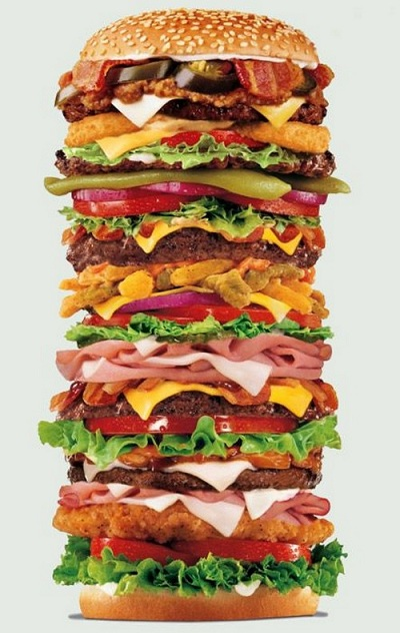

---

# Unicode Sandwich

* Decode as early as possible
* Unicode everywhere in the middle
* Encode as late as possible

---

# Decoding

#### Reading Files

    !python
    import codecs
    with codecs.open('utf8_sample_data.rst',
                     encoding='utf-8'):
        for line in f:
            print repr(line)

#### Reading from wire

    !python
    def get_mem_status(self):
        try:
            return self.port.recv(256).decode('utf-8')
        except timeout, data:
            raise SocketTimeoutError(data)

.fx: smaller

---

# Encoding

#### Writing Files

    !python
    try:
        self.port.sendall(dpl.encode('utf-8'))
    except socket.timeout:
        logging.error('Printer timeout, unable to send')
        self.abort_job.set()

#### Manual SQL save

    !python
    def save_to_db(self, part_id, file_name, version, lane_count, file_data):
        self.xml_file_text = file_data
        sql_handle = MySqlInterface()
        if self.xml_exists_in_db(file_name):
            sql = "UPDATE `op_print_template` SET `partID`=%s, " \
                "`laneCount`=%s, `version`=%s, `fileData`=%s "\
                "WHERE `filename`=%s"
            params = [part_id, lane_count, version,
                      file_data.encode('utf-8'), file_name]
            sql_handle.query("template", sql, params=params)
            return
        sql = "INSERT INTO `op_print_template` (`partID`, `laneCount`" \
            ", `version`, `fileData`, `filename`) VALUES (%s, %s, %s," \
            " %s, %s)"
        params = [part_id, lane_count, version,
                  file_data.encode('utf-8'), file_name]
        sql_handle.query("template", sql, params=params)

.fx: smallest

---

# Combined Examples

#### ElementTree

    !python
    def format_dpl_template_xml(unicode_xml_string):
        root = ET.fromstring(
            unicode_xml_string.encode('utf-8'))
        indent(root)
        xml_string = ET.tostring(root, 'utf-8') \
            .decode('utf-8')
        header = '<?xml version="1.0" encoding="UTF-8" standalone="yes" ?>\n'
        # returns in unicode
        return header + xml_string

#### wxPython html window

    !python
    self.html.SetPage(
        data.decode('utf-8').encode('iso-8859-7'))

.fx: smaller

---

# Tips from python.org

* Software should only work with Unicode strings internally, converting to a particular encoding on output.

* Include characters > 127 and, even better, characters > 255 in your test data.

---

# Attack Vector

    !python
    def read_file (filename, encoding):
    if '/' in filename:
        raise ValueError("'/' not allowed in filenames")
    unicode_name = filename.decode(encoding)
    f = open(unicode_name, 'r')
    # ... return contents of file ...

# presenter notes

For example, let’s say you have a content management system that takes a Unicode filename, and you want to disallow paths with a ‘/’ character. You might write this code:

---

# Attack Vector

    !python
    def read_file (filename, encoding):
    if '/' in filename:
        raise ValueError("'/' not allowed in filenames")
    unicode_name = filename.decode(encoding)
    f = open(unicode_name, 'r')
    # ... return contents of file ...

if attacker could specify the 'base64' encoding, they could pass 'L2V0Yy9wYXNzd2Q=', which is the base-64 encoded form of the string '/etc/passwd'

# presenter notes

However, if an attacker could specify the 'base64' encoding, they could pass 'L2V0Yy9wYXNzd2Q=', which is the base-64 encoded form of the string '/etc/passwd', to read a system file. The above code looks for '/' characters in the encoded form and misses the dangerous character in the resulting decoded form.

---

# Python 3 Unicode

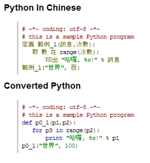

---

# Ned’s 5 Facts of Life

1. Computers are built on bytes
2. The world needs more than 256 symbols
3. Need to keep them straight.  Need to deal with both.
4. You cannot infer the encoding of bytes.  You must be told, or you have to guess.
5. Sometimes you are told wrong.

---

# Best Practices

**Email**

```
Content-Type: text/plain; charset="UTF-8"
```

**Web**

    !html
    <meta http-equiv="Content-Type" content="text/html; charset=utf-8">

**Python**

    !python
    # -*- coding: utf-8 -*-
    from __future__ import unicode_literals

**MySQL**

```
utf8_general_ci
utf8_unicode_ci
```

* Difference? utf8_general_ci is satisfactory for both German and French, except that “ß” is equal to “s”, and not to “ss”. If this is acceptable for your application, you should use utf8_general_ci because it is faster. Otherwise, use utf8_unicode_ci because it is more accurate.

.fx: smallest

# presenter notes

python has additional header for unicode spec

mysql explanation of unicode

---

#### References

* “Pragmatic Unicode” by Ned Batchelder. <a href="http://nedbatchelder.com/text/unipain.html">http://nedbatchelder.com/text/unipain.html</a>.
* “The Absolute Minimum Every Software Developer Absolutely, Positively Must Know About Unicode and Character Sets (No Excuses!)” by Joel Spolsky. <a href="http://www.joelonsoftware.com/articles/Unicode.html">http://www.joelonsoftware.com/articles/Unicode.html</a>.
* Python.org Unicode HowTo. <a href="https://docs.python.org/2/howto/unicode.html">https://docs.python.org/2/howto/unicode.html</a>.
* Travis Fischer, Esther Nam: Character encoding and Unicode in Python - PyCon 2014. <a href="https://www.youtube.com/watch?v=Mx70n1dL534">https://www.youtube.com/watch?v=Mx70n1dL534</a>.

#### Image Credits

* <a href="https://www.flickr.com/photos/kalexanderson/5421517469">https://www.flickr.com/photos/kalexanderson/5421517469</a>
* <a href="https://www.flickr.com/photos/ktkatrina/2690495387">https://www.flickr.com/photos/ktkatrina/2690495387</a>

.fx: smallest

---

# Thank you

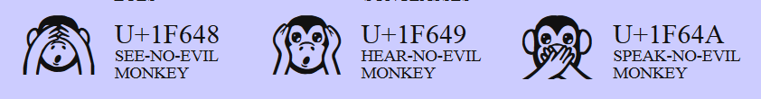


<a href="http://ernstrom.net/unicode.html">http://ernstrom.net/unicode.html</a>

.fx: titleslide
